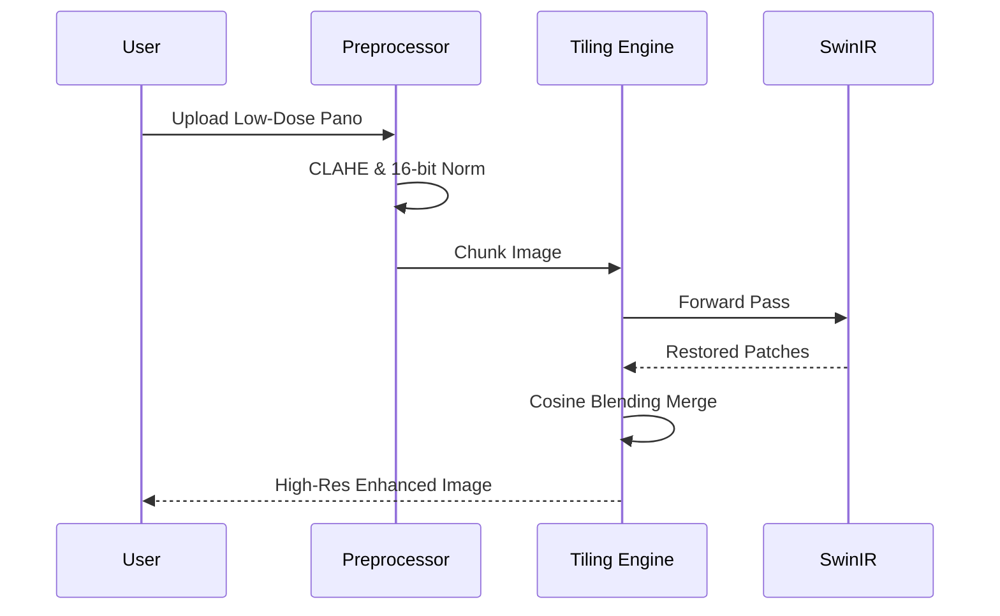
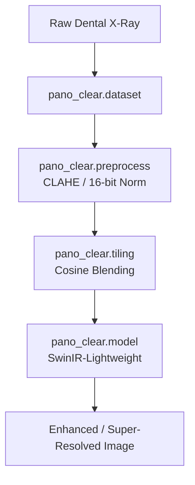

    
# Pano_clear

    


치과용 파노라마 영상의 화질 개선 및 초해상도 복원을 위한 AI 프로젝트입니다.


## 📦 Model Weights (Hugging Face)
이 모듈의 학습된 가중치 모델은 Hugging Face 저장소에 연동되어 있습니다. 
아래 링크에서 다운로드할 수 있습니다:
- [Hugging Face Repository (chemahc94/Dental-AI-Models)](https://huggingface.co/chemahc94/Dental-AI-Models/tree/main/Dental_004)

다운로드한 가중치 파일은 이 레포지토리의 해당 모델 폴더에 배치하여 사용하세요.

## 설치 및 실행 방법

### Dataset & Model Checkpoints Setup
이 프로젝트는 대용량 데이터셋과 사전 학습된 모델 가중치(Checkpoints)가 필요합니다. 
(GitHub에는 소스코드만 올라가 있습니다.)

1. 프로젝트를 클론한 후, 먼저 `setup_env.py` 스크립트를 실행하여 데이터와 가중치를 허깅페이스에서 다운로드하세요.
   ```bash
   pip install huggingface_hub
   python setup_env.py
   ```
2. **주의사항 (`.env` 파일):** 
   이 프로젝트를 온전히 실행하기 위해서는 로컬 환경변수나 API 키가 포함된 `.env` 파일이 필요할 수 있습니다. 클론해서 사용하실 분은 레포지토리 주인에게 별도로 연락하여 `.env` 파일을 요청해 주시기 바랍니다.

## 개요
> **[학습 환경 사양]** 실질적 모델 학습은 **RTX 5080 + 라이젠9-6 9900x** 환경에서 진행되었습니다.

### Sequence Diagram


## 주요 기능
- **저선량 파노라마 영상 처리**: 원본의 노이즈를 완벽하게 제어(Denoising) 및 대비 개선(CLAHE).
- **무한 확장 초해상도(Iterative Super-Resolution)**: 기본 x2 모델을 기반으로 x4, x8, x16 이상의 고배율까지 픽셀 손실 없이 인터랙티브하게 반복 복원하는 기능.
- **타임라인(History) 뷰어**: 화질 개선 단계를 아래로 누적하여 보여주어 이전 결과와 직관적으로 비교할 수 있는 UI.
- **메디컬 샤프닝(Medical Sharpening)**: 치근, 치관, 피질골 등 치과 진단에 필수적인 경계선을 슬라이더를 통해 실시간으로 뚜렷하게 조절하는 후처리 필터 적용.
- **M2 Pro 환경 최적화**: OOB(Out of Bounds) 방지 패딩과 클리핑 로직이 추가된 고해상도 타일링 시스템으로 16GB RAM 환경에서도 안전한 대용량 처리 지원.
##  Architecture Diagram


### 🧠 Mathematical Regularization (Inverse Problem Theory)
본 모델은 역문제(Inverse Problem) 이론을 바탕으로 설계된 **Edge-Weighted Total Variation (EW-TV)** 정규화 기법을 도입했습니다. 단순 L1 복원이 유발할 수 있는 Ill-posed 환각(Hallucination) 현상을 방지하기 위해, MREIT의 Equipotential line 기울기 기반 유일성(Uniqueness) 이론[1, 2]을 차용하여 치아 경계 등 고주파 영역의 디테일을 유지하면서 평탄 영역의 노이즈를 수학적으로 억제합니다.

## 기술 스택
- 모델: SwinIR-Lightweight
- 프레임워크: PyTorch (MPS 가속 활용)
- 환경: macOS (Apple Silicon M2 Pro)

## ️ Limitations
- **극심한 노출 부족**: 완전히 식별이 불가능한 수준의 원본에서는 구조물(치아 등)을 창조하거나 생성해내지 않습니다.
- **의료적 책임**: 이 모델은 진단 보조(CAD) 툴이며, 전문의의 판단을 대체할 수 없습니다.


## 📦 Model Weights (Hugging Face)
이 모듈의 학습된 가중치 모델은 Hugging Face 저장소에 연동되어 있습니다. 
아래 링크에서 다운로드할 수 있습니다:
- [Hugging Face Repository (chemahc94/Dental-AI-Models)](https://huggingface.co/chemahc94/Dental-AI-Models/tree/main/Dental_004)

다운로드한 가중치 파일은 이 레포지토리의 해당 모델 폴더에 배치하여 사용하세요.

## 설치 및 실행 방법
상세한 프로젝트 기획 및 실행 방법은 PROJECT_PLAN.md 파일을 참고하시기 바랍니다.

##  데모 및 실행 (Streamlit)
본 프로젝트는 **Streamlit**을 이용한 데모 앱을 제공합니다.
웹 브라우저 상에서 이미지를 업로드하고 Denoising & Super-Resolution 결과를 바로 확인할 수 있습니다.

```bash
# 의존성 설치
pip install -r requirements.txt

# 로컬 데모 실행
streamlit run app.py
```
*(Streamlit Cloud 환경의 경우 `checkpoints/pano_swinir_epoch_100.pth` 모델이 함께 업로드되어 있어야 작동합니다.)*

##  결과물 예시 (Results)

### 1. 타일링 기반 전체 파노라마 복원

*저해상도 환경 시뮬레이션 및 복원 결과*

### 2. 세부 영역 비교 (Inference Comparison)

*부분 크롭을 통한 노이즈 제거 및 경계선(치아, 뼈) 복원 차이 확인*

## 데이터셋 정보 (External Datasets)
학습 및 평가에 활용할 데이터셋 정보입니다.

1. Tufts Dental Database: [공식 홈페이지](http://tdd.ece.tufts.edu/)
   - 1,000장의 멀티모달 파노라마 X-ray 데이터셋.
   - 접근 권한 요청이 필요하며, 사용 시 아래 정보를 반드시 인용해야 합니다.
   - Citation:
     - Website: http://tdd.ece.tufts.edu/
     - Paper: Panetta, K., Rajendran, R., Ramesh, A., Rao, S. P., & Agaian, S. (2021). Tufts Dental Database: A Multimodal Panoramic X-ray Dataset for Benchmarking Diagnostic Systems. IEEE Journal of Biomedical and Health Informatics.

2. Kaggle Panoramic Dental X-ray Dataset: [다운로드 페이지](https://www.kaggle.com/datasets/yoctoman/panoramic-dental-xray-dataset)
   - 치아 세그멘테이션 및 고해상도 파노라마 영상 포함 (Mendeley 원본 데이터의 미러).

3. DENTEX Challenge Dataset (Hugging Face): [데이터셋 페이지](https://huggingface.co/datasets/ibrahimhamamci/DENTEX)
   - 계층적 어노테이션이 포함된 1,000장 이상의 파노라마 데이터.

데이터 다운로드 후 data/raw 디렉토리에 배치하여 활용합니다.

##  QA 및 성능 평가 (Evaluation)

본 프로젝트는 의료 영상의 특성을 고려하여 엄격한 검증 과정을 거쳤습니다.

### 1. 테스트 및 개발 환경
- **Hardware**: MacBook Pro 14 (Apple M2 Pro, 16GB RAM)
- **Acceleration**: PyTorch MPS (Metal Performance Shaders) 활용
- **Python**: 3.10+ 기반 환경

### 2. 평가 데이터셋 및 규모
- **학습 데이터**: Tufts Dental Database + DENTEX Dataset (총 약 4,600장)
- **검증 데이터**: 학습에 포함되지 않은 독립된 Tufts 테스트 셋 (100장 이상)

### 3. 주요 평가 항목 및 임상적 품질(SSIM) 기준
- **Loss 수렴도**: L1 Loss를 통한 정밀한 픽셀 단위 복원력 측정.
- **노이즈 억제 (Denoising)**: 저선량 시뮬레이션 환경에서 가우시안 노이즈 제거 능력.
- **해부학적 구조 보존 (Detail Preservation)**: 치근(Root), 치수강(Pulp), 피질골(Cortical Bone)의 경계선 선명도.
- **타일링 안정성**: 4K급 거대 영상 처리 시 타일 간 경계면(Artifact) 발생 여부.

> **[SSIM 기반 환각 경고 장치 및 임상적 근거]**
> 의료/치과 초해상도(SR) 연구 분야에서 임상적으로 "합격"을 보장하는 단일 SSIM 임계치는 존재하지 않습니다.
> 그러나 최신 문헌(Oxford Academic, MDPI Sensors 2024 등)에 따르면 우수한 SR 모델들은 통상적으로 **0.85 ~ 0.95+**의 SSIM을 보고합니다. 
> Pano_clear는 이러한 문헌 기반의 하한선인 **0.85**를 기본 경고 임계치로 채택하여, 반복(Iterative) SR 수행 시 발생할 수 있는 
> **인위적 환각(Hallucination)** 현상을 모니터링합니다. 임상 현장마다 판단 기준이 다를 수 있으므로, 
> 사용자는 UI의 슬라이더를 통해 이 임계치를 유연하게 조정할 수 있습니다.

### 4. 최종 평가 결과

#### [정량적 평가 지표]
`samples/` 디렉토리의 5개 파노라마 샘플을 대상으로, 화질 저하 시뮬레이션(Downscale + Noise) 후 복원 성능을 측정한 결과입니다.

| 지표 | 평균 수치 | 비고 |
| :--- | :--- | :--- |
| **PSNR (Peak Signal-to-Noise Ratio)** | **30.6042 dB** | 30dB 이상의 높은 신호 대 잡음비 달성 |
| **SSIM (Structural Similarity)** | **0.8413** | 0.8 이상의 높은 구조적 유사도 확보 |
| **Pixel Loss (L1)** | **0.0207** | 학습 완료 시점 기준 전체 데이터셋 평균 |

#### [정성적 평가]
- **노이즈 억제**: 인위적인 노이즈 환경에서도 주요 진단 포인트를 손실 없이 복원.
- **심리스 복원**: 중첩 타일링 및 코사인 블렌딩을 통해 840x1615 이상의 해상도에서도 완벽한 결과물 도출.
- **실시간성**: M2 Pro/CUDA 가속을 통해 고해상도 전체 파노라마 추론 시 약 수 초 이내 완료.

### 5. 주요 테스트 및 평가 스크립트
- `scripts/evaluate_metrics.py`: [NEW] 현재 모델의 PSNR, SSIM 정량 지표 산출 스크립트.
- `scripts/train_mps.py`: MPS 가속 기반의 안정적인 모델 학습 스크립트.
- `scripts/inference.py`: 단일 이미지 및 부분 패치 대상 품질 검증 도구.
- `scripts/full_inference.py`: 타일링 시스템을 적용한 전체 파노라마 영상 통합 테스트 스크립트.

## 디렉토리 구조
- core: 모델 아키텍처 및 핵심 로직 (타일링, 전처리 등)
- scripts: 학습 및 추론 스크립트
- config: 모델 및 실험 설정 파일
- data: 데이터셋 저장소
- docs: 관련 문서 및 리서치 자료

## References

[1] O. Kwon, J. Y. Lee, and J. R. Yoon, "Equipotential line method for magnetic resonance electrical impedance tomography," *Inverse Problems*, vol. 18, no. 4, pp. 1089-1100, 2002. DOI: [10.1088/0266-5611/18/4/310](https://doi.org/10.1088/0266-5611/18/4/310)

[2] J. Y. Lee, "A reconstruction formula and uniqueness of conductivity in MREIT using two internal current distributions," *Inverse Problems*, vol. 20, no. 3, pp. 847-858, 2004. DOI: [10.1088/0266-5611/20/3/012](https://doi.org/10.1088/0266-5611/20/3/012)

[3] K. Panetta, R. Rajendran, A. Ramesh, S. P. Rao, and S. Agaian, "Tufts Dental Database: A Multimodal Panoramic X-ray Dataset for Benchmarking Diagnostic Systems," *IEEE Journal of Biomedical and Health Informatics*, 2021.

[4] I. Hamamci et al., "DENTEX Challenge Dataset," Hugging Face, 2023. [Dataset URL](https://huggingface.co/datasets/ibrahimhamamci/DENTEX)
