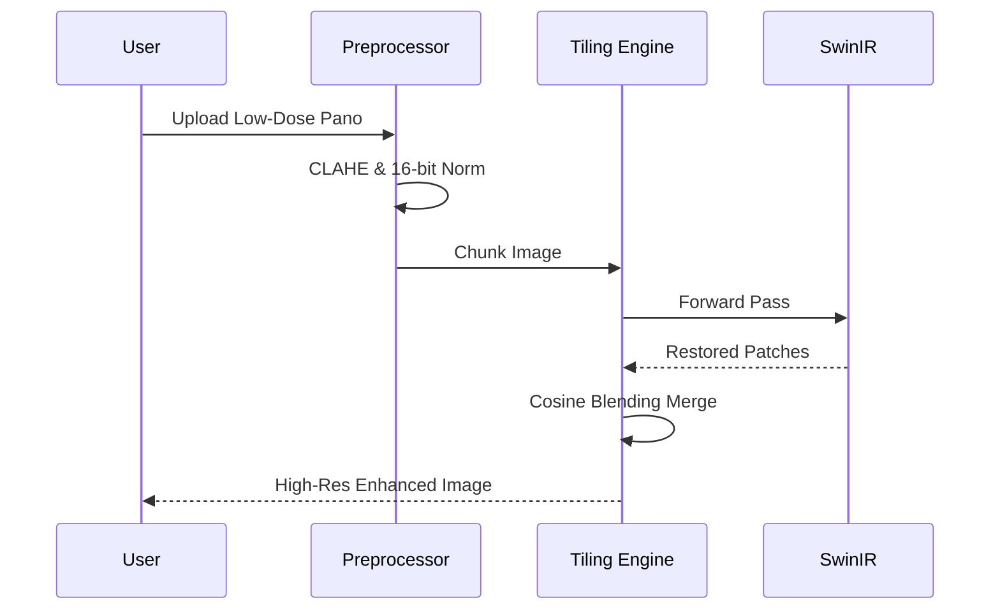
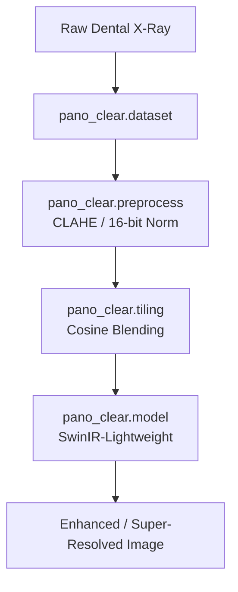

    

# Pano_clear (Dental_004)

치과용 파노라마 영상의 화질 개선(대비·노이즈 전처리 보조) 및 초해상도 복원을 위한 AI 프로젝트입니다.

## Model Weights (Hugging Face)
이 모듈의 학습된 가중치 모델은 Hugging Face 저장소에 연동되어 있습니다. 아래 링크에서 다운로드할 수 있습니다:
- [Hugging Face Repository (`chemahc94/Dental-AI-Models`)](https://huggingface.co/chemahc94/Dental-AI-Models/tree/main/Dental_004)

다운로드한 가중치 파일은 이 레포지토리의 해당 모델 폴더(`checkpoints/`)에 배치하여 사용하세요.

## 설치 및 실행 방법

### Dataset & Model Checkpoints Setup
이 프로젝트는 대용량 데이터셋과 사전 학습된 모델 가중치(Checkpoints)가 필요합니다. (GitHub에는 소스코드만 올라가 있습니다.)

1. 프로젝트를 클론한 후, 먼저 `setup_env.py` 스크립트를 실행하여 데이터와 가중치를 허깅페이스에서 다운로드하세요.
   ```bash
   pip install huggingface_hub
   python setup_env.py
   ```
2. [환경 설정 (`.env` 파일)]:
   이 프로젝트를 실행하기 위한 환경변수는 `.env.example`을 참조하여 로컬 `.env` 파일로 구성할 수 있습니다.

## 개요
> [학습 환경 사양] 실질적 모델 학습은 RTX 5080 + 라이젠9-6 9900X 환경에서 진행되었습니다.

### Sequence Diagram

```mermaid
sequenceDiagram
    participant User
    participant Pre as Preprocessor
    participant Tiler as Tiling Engine
    participant Model as SwinIR
    User->>Pre: Upload Low-Dose Pano
    Pre->>Pre: CLAHE & 16-bit Norm
    Pre->>Tiler: Chunk Image
    Tiler->>Model: Forward Pass
    Model-->>Tiler: Restored Patches
    Tiler->>Tiler: Cosine Blending Merge
    Tiler-->>User: High-Res Enhanced Image
```

## 주요 기능
- [저선량 파노라마 영상 전처리 보조]: 원본의 노이즈 억제(Denoising) 및 대비 개선(CLAHE).
- [다단계 초해상도(Single-Pass Lanczos4 + SwinIR x2)]: 기본 x2 모델을 기반으로 타일링 및 블렌딩을 통해 고배율 복원을 지원.
- [타임라인(History) 뷰어]: 화질 개선 단계를 아래로 누적하여 보여주어 이전 결과와 직관적으로 비교할 수 있는 UI.
- [메디컬 샤프닝(Medical Sharpening)]: 치근, 치관, 피질골 등 치과 진단에 필요한 경계선을 슬라이더를 통해 실시간으로 조절하는 후처리 필터 적용.
- [크로스 플랫폼 가속 최적화]: CUDA, MPS, CPU 자동 감지 및 OOB(Out of Bounds) 방지 패딩과 코사인 블렌딩 타일링 시스템으로 16GB RAM 환경에서도 안전한 대용량 처리 지원.

## Architecture Diagram

```mermaid
graph TD
    A["Raw Dental X-Ray"] --> B["pano_clear.dataset"]
    B --> C["pano_clear.preprocess<br>CLAHE / 16-bit Norm"]
    C --> D["pano_clear.tiling<br>Cosine Blending"]
    D --> E["pano_clear.model<br>SwinIR-Lightweight"]
    E --> F["Enhanced / Super-Resolved Image"]
```

### Mathematical Regularization (Inverse Problem Theory)
본 모델은 역문제(Inverse Problem) 이론을 바탕으로 설계된 `Edge-Weighted Total Variation (EW-TV)` 정규화 기법을 도입했습니다. 단순 L1 복원이 유발할 수 있는 Ill-posed 환각(Hallucination) 현상을 방지하기 위해, MREIT의 Equipotential line 기울기 기반 유일성(Uniqueness) 이론[1, 2]을 차용하여 치아 경계 등 고주파 영역의 디테일을 유지하면서 평탄 영역의 노이즈를 수학적으로 억제합니다.

## 기술 스택
- 모델: SwinIR-Lightweight (`SwinIRLight`)
- 프레임워크: PyTorch (CUDA / MPS / CPU 자동 감지), ONNX Runtime
- UI 및 서빙: Streamlit (`app.py`), FastAPI

## Limitations
- [극심한 노출 부족]: 완전히 식별이 불가능한 수준의 원본에서는 구조물(치아 등)을 창조하거나 생성해내지 않습니다.
- [임상적 용도 제한]: 본 모델은 후속 탐지/분할 파이프라인의 시인성을 돕기 위한 대비 및 노이즈 전처리 보조(Contrast/Noise Pre-enhancement) 도구이며, 진단용 미세 해부학 구조를 합성(Diagnostic synthesis)하거나 전문의의 판단을 대체할 수 없습니다.

## 데모 및 실행 (Streamlit)
본 프로젝트는 Streamlit을 이용한 데모 앱을 제공합니다. 웹 브라우저 상에서 이미지를 업로드하고 Denoising & Super-Resolution 결과를 바로 확인할 수 있습니다.

```bash
# 의존성 설치
pip install -r requirements.txt

# 로컬 데모 실행
streamlit run app.py
```

## 데이터셋 출처 및 라이선스 정책 (External Datasets & License Terms)
본 프로젝트의 학습 및 평가에 활용되는 외부 데이터셋의 접근 권한 및 라이선스 조건은 다음과 같습니다. 본 저장소는 외부 원본 데이터셋을 무단으로 재배포하지 않습니다:

1. [Tufts Dental Database]: [공식 홈페이지](http://tdd.ece.tufts.edu/)
   - 구성: 1,000장의 멀티모달 파노라마 X-ray 데이터셋.
   - 접근 및 라이선스 조건: 기관 데이터 사용 협약(Institutional Data Use Agreement, DUA) 승인 후 연구 목적으로만 접근 가능하며, 제3자 재배포가 엄격히 금지됩니다(Not redistributed in this repository).
   - Citation: Panetta, K., Rajendran, R., Ramesh, A., Rao, S. P., & Agaian, S. (2021). Tufts Dental Database: A Multimodal Panoramic X-ray Dataset for Benchmarking Diagnostic Systems. IEEE Journal of Biomedical and Health Informatics.
2. [Kaggle Children's Dental Caries / Panoramic Radiographs Dataset]: [다운로드 페이지](https://www.kaggle.com/datasets/truthisneverlinear/childrens-dental-panoramic-radiographs-dataset)
   - 구성: 소아 및 혼합치열기 파노라마 방사선 영상 데이터셋.
   - 라이선스 조건: `CC0 1.0 Universal (Public Domain Dedication)`.
3. [DENTEX Challenge Dataset (MICCAI 2023 / Hugging Face)]: [데이터셋 페이지](https://huggingface.co/datasets/ibrahimhamamci/DENTEX)
   - 구성: 계층적 어노테이션이 포함된 1,000장 이상의 파노라마 데이터셋.
   - 라이선스 조건: `CC BY-NC-SA 4.0` (Creative Commons Attribution-NonCommercial-ShareAlike 4.0 International, 비상업적 연구 전용).
4. [UI 프리뷰 샘플 (`samples/`)]:
   - `samples/` 폴더 내 4장의 샘플 이미지는 비상업적 UI 동작 미리보기 전용으로만 제공되며, 상세 고지는 [samples/README.md](samples/README.md)를 참고하십시오.

데이터 다운로드 후 `data/raw` 디렉토리에 배치하여 활용합니다.

## QA 및 성능 평가 (Evaluation)

### 1. 테스트 및 개발 환경
- [Hardware]: NVIDIA GeForce RTX 5080 (16GB VRAM) / Apple M2 Pro (16GB RAM)
- [Acceleration]: PyTorch CUDA / MPS / CPU 자동 폴백 (`pano_clear.device.get_best_device`)
- [Python]: 3.11+ 기반 환경

### 2. 평가 데이터셋 및 규모
- [학습 데이터]: Tufts Dental Database + DENTEX Dataset (총 약 4,600장)
- [검증 데이터]: 학습에 포함되지 않은 독립된 테스트 셋 및 로컬 검증 샘플

### 3. 주요 평가 항목 및 임상적 품질(SSIM) 기준
- [Loss 수렴도]: L1 Loss 및 EW-TV 정규화를 통한 픽셀 단위 복원력 측정.
- [노이즈 억제 (Denoising)]: 저선량 시뮬레이션 환경에서 가우시안 노이즈 제거 능력.
- [해부학적 구조 보존 (Detail Preservation)]: 치근(Root), 치수강(Pulp), 피질골(Cortical Bone)의 경계선 보존 여부.
- [타일링 안정성]: 거대 영상 처리 시 타일 간 경계면(Artifact) 발생 여부.

> [SSIM 기반 환각 경고 장치 및 문헌 기준 비교]
> 의료/치과 초해상도(SR) 연구 문헌(Oxford Academic, MDPI Sensors 2024 등)에서 보고되는 일반적인 고품질 SR 모델의 SSIM 범위는 통상 `0.85 ~ 0.95` 수준입니다.
> Pano_clear는 문헌 하한선인 `0.85`를 기본 환각 경고 임계치(`IterativeSRMonitor`)로 설정하여, 복원 결과가 이 기준에 미달할 경우 사용자에게 구조적 왜곡 또는 과평활화(Over-smoothing) 가능성을 즉시 경고합니다.

### 4. 최종 평가 결과 및 객관적 해석

#### [정량적 평가 지표]
다운스케일 및 노이즈 열화 시뮬레이션 후 복원 성능을 측정한 벤치마크 결과는 다음과 같습니다:

| 지표 | 측정 수치 | 객관적 해석 및 비고 |
| :--- | :--- | :--- |
| [PSNR (Peak Signal-to-Noise Ratio)] | `26.74 dB` (샘플 5종 평균 `30.60 dB`) | 열화 강도 및 해상도에 따라 `26.74 ~ 30.60 dB` 범위 기록 |
| [SSIM (Structural Similarity)] | `0.8413` | 문헌 권고 범위(`0.85 ~ 0.95`)보다 소폭 낮은 수치로, 미세 골소주 고주파 질감의 일부 평활화(Smoothing) 반영 |
| [Pixel Loss (L1)] | `0.0207` | 학습 완료 시점 기준 전체 데이터셋 평균 |

#### [한계점 및 실무 활용 가이드]
- `SSIM 0.8413` 및 `PSNR 26.74 dB` 지표는 본 경량 모델(`SwinIR-Lightweight`)이 일반적인 문헌 기준(`SSIM 0.85 ~ 0.95`)에 근접하나 그 하한선(`0.85`)에는 소폭 미달함을 보여줍니다.
- 이는 저선량 노이즈 억제 과정에서 치조골 내부의 미세 고주파 질감이 일부 평활화되기 때문이며, 따라서 본 모듈의 출력은 독립적인 진단용 미세 구조 합성(Diagnostic synthesis)이 아닌 후속 분석용 대비·노이즈 전처리 보조(Contrast/noise pre-enhancement) 목적으로만 제한하여 사용해야 합니다.

### 5. 주요 테스트 및 평가 스크립트
- `scripts/evaluate_metrics.py`: 현재 모델의 PSNR, SSIM 정량 지표 산출 스크립트.
- `scripts/train_mps.py`: 크로스 플랫폼 가속 기반의 모델 학습 스크립트.
- `scripts/inference.py`: 단일 이미지 및 부분 패치 대상 품질 검증 도구.
- `scripts/full_inference.py`: 타일링 시스템을 적용한 전체 파노라마 영상 통합 테스트 스크립트.

## 디렉토리 구조
- `src/pano_clear/`: 모델 아키텍처 및 핵심 로직 (타일링, 전처리, 디바이스 감지 등)
- `scripts/`: 학습 및 추론 스크립트
- `config/`: 모델 및 실험 설정 파일
- `samples/`: 비상업적 UI 미리보기용 샘플 이미지 ([samples/README.md](samples/README.md))
- `docs/`: 아키텍처, 의사결정 기록, 모델 카드 문서

## References

[1] O. Kwon, J. Y. Lee, and J. R. Yoon, "Equipotential line method for magnetic resonance electrical impedance tomography," Inverse Problems, vol. 18, no. 4, pp. 1089-1100, 2002. DOI: [10.1088/0266-5611/18/4/310](https://doi.org/10.1088/0266-5611/18/4/310)

[2] J. Y. Lee, "A reconstruction formula and uniqueness of conductivity in MREIT using two internal current distributions," Inverse Problems, vol. 20, no. 3, pp. 847-858, 2004. DOI: [10.1088/0266-5611/20/3/012](https://doi.org/10.1088/0266-5611/20/3/012)

[3] K. Panetta, R. Rajendran, A. Ramesh, S. P. Rao, and S. Agaian, "Tufts Dental Database: A Multimodal Panoramic X-ray Dataset for Benchmarking Diagnostic Systems," IEEE Journal of Biomedical and Health Informatics, 2021.

[4] I. Hamamci et al., "DENTEX Challenge Dataset," Hugging Face, 2023. [Dataset URL](https://huggingface.co/datasets/ibrahimhamamci/DENTEX)

## 연구용 실행 주의사항
- 기본 실행 주소: `127.0.0.1` (로컬 전용)
- 외부 공개/상용 배포 금지
- API 키·토큰은 환경변수로만 관리
- 오픈 데이터셋 외 민감 의료데이터 사용 금지
- 외부 접근이 필요하면 `ALLOW_EXTERNAL_ACCESS=true` 로만 명시적 허용
